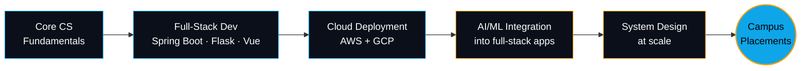

<div align="center">


<a href="https://git.io/typing-svg">
  
</a>

<br/>

[](https://www.linkedin.com/in/radhikamraikar)
[](mailto:radhikaraikar785@gmail.com)
[](https://github.com/radhikaraikar)
[](https://radhika-lac.vercel.app/)
[](#)


</div>

<br/>

## `>` about.config

<table>
<tr>
<td width="55%" valign="top">

```json
{
  "identity": {
    "name": "Radhika Raikar",
    "role": "Computer Science Undergraduate",
    "institution": "AIET, Mangalore",
    "focus": ["Full-Stack Dev", "AI/ML Integration", "Cloud"]
  },
  "currently": [
    "polishing a cinematic 3D developer portfolio",
    "shipping AI-agent + cloud prototypes",
    "prepping for campus placements"
  ],
  "philosophy": "build it end to end, then make it feel alive",
  "status": "open_to_opportunities"
}
```

</td>
<td width="45%" valign="top">

### ⚡ Signal

- 🎓 CS undergrad, strong academic record
- 🧠 AI/ML integration across full-stack apps
- ☁️ AWS + Google Cloud, deployment-minded
- 🏆 Salesforce Certified Platform Developer
- 🥇 Agentblazer Champion (Trailhead)
- 🎯 Actively pursuing campus placements

</td>
</tr>
</table>

---

## `>` tech.stack

<div align="center">

**Languages & Core**


**Frontend & Motion**


**Backend & Frameworks**


**Cloud & DevOps**


**Data & Databases**


**Platform / Low-Code**


</div>

---

## `>` featured.builds

<table>
<tr>
<td width="33%" valign="top">

### 🧭 PathFinder
**AR campus navigation prototype**

`AR` `Mobile` `Spatial Computing`

- Real-time AR wayfinding for campus environments
- Prototyped and evaluated as a major EDC project
- Focus on spatial UX over flat map overlays

</td>
<td width="33%" valign="top">

### 🛰️ VAJRA-SETU
**Route resilience system architecture**

`System Design` `Disaster Response`

- Designed for PS4 (Route Resilience) at Bharatiya Antariksh Hackathon
- Architecture for resilient routing under disruption
- One of 14 problem statements analyzed end-to-end

</td>
<td width="33%" valign="top">

### 🤖 Retail Promo Agent
**GenAI retail optimisation agent**

`GenAI` `Agents` `Automation`

- Drag-and-drop agent built for an AI Agent Builder Challenge
- Retail promotion optimisation logic on Dify
- Explored agentic workflow design patterns

</td>
</tr>
</table>

<div align="center">
<sub>Plus an ongoing dark, cinematic, WebGL-driven <a href="https://radhika-lac.vercel.app/">developer portfolio</a> — Vue 3 + TypeScript + three.js + GSAP, bilingual case studies. <a href="https://radhika-lac.vercel.app/">→ radhika-lac.vercel.app</a></sub>
</div>

---

## `>` github.stats

<div align="center">


</div>

---

## `>` contribution.stream

<div align="center">


<sub>⚠️ Live snake animation — generated by a scheduled GitHub Action. See setup note below.</sub>

</div>

---

## `>` roadmap.mmd



---

## `>` connect

<div align="center">

Open to full-stack, AI/ML, and cloud engineering roles — always up for a conversation about system design or shipping something interesting.

[](https://www.linkedin.com/in/radhikamraikar)
[](mailto:radhikaraikar785@gmail.com)
[](https://radhika-lac.vercel.app/)

<br/>


*Designed in the dark, deployed to the cloud.*

</div>
